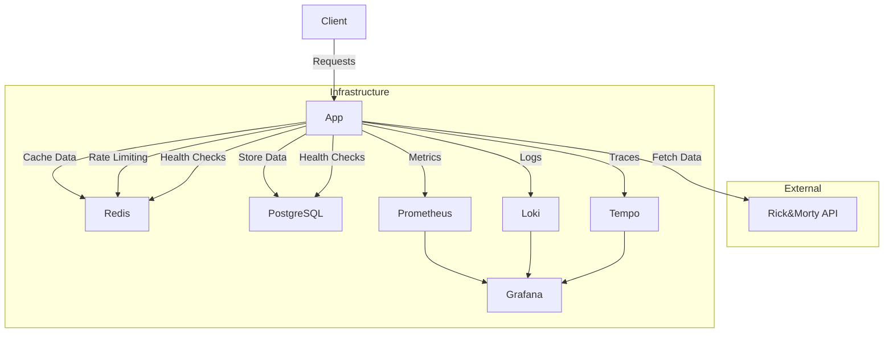
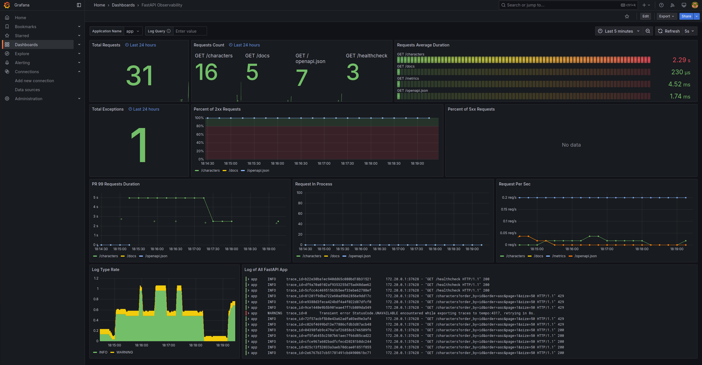
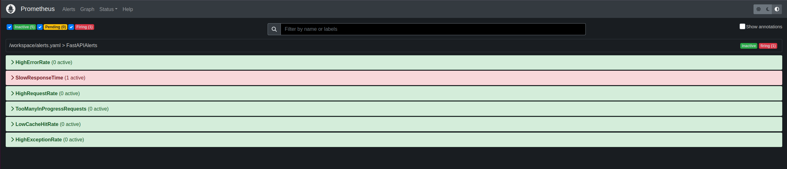

# Rick and Morty Character API with Observability

A FastAPI-based microservice that manages character data from the Rick and Morty API.

## Architecture



## Prerequisites

- Docker and Docker Compose
- kind (Kubernetes in Docker)
- flux (FluxCD CLI)

## Setup

> [!NOTE]
> Kind deployment does not include the observability stack and is meant for kubernetes integration testing.
> To test the observability stack, you need to deploy through docker-compose option.
>

### Build image

```bash
make build
```

### Deploy through docker-compose

```bash
make docker-compose
```

### Deploy through kind

As Kind deployment implements gitops using flux, you need to satisfy the prerequisites below.

- Fork the repository
- Set up a GitHub personal access token (PAT) with the necessary permissions to be able to read from your fork
- Set the following environment variables

```bash
export GITHUB_PAT=<your-github-pat>
export GITHUB_URL=<your-github-repo-url> # e.g. https://github.com/forselli/akamai-sre-home-assignment
export GITHUB_BRANCH=<your-branch>
export GITHUB_USERNAME=<your-github-username>
```

Deploy the app through kind.

```bash
make kind
```

## Test the application

> [!NOTE]
> The following examples are based on docker-compose deployment. If you deploy through kind, the access url is: https://localhost/app/docs
>

- Web browser access

```bash
firefox http://localhost:8000/docs # Firefox example
```

- Get the OpenAPI spec

```bash
curl http://localhost:8000/openapi.json
```

- Get characters

```bash
curl -X 'GET' \
  'http://localhost:8000/characters' \
  -H 'accept: application/json'
```

- Get characters ordered by id

```bash
curl -X 'GET' \
  'http://localhost:8000/characters?order_by=id&order=asc&page=1&size=50' \
  -H 'accept: application/json'
```

- Get characters by page and size

```bash
curl -X 'GET' \
  'http://localhost:8000/characters?page=3&size=10' \
  -H 'accept: application/json'
```

## Observability

### Grafana

- Access the Grafana dashboard

```bash
firefox http://localhost:3000
```



### Prometheus

- Access the Prometheus dashboard and check the metrics and defined alerts

```bash
firefox http://localhost:9090
```



## Cleanup

```bash
make docker-compose-rm
```

```bash
make kind-rm
```

## References

- https://rickandmortyapi.com/
- https://fastapi.tiangolo.com/tutorial/
- https://github.com/FastAPI-MEA/fastapi-template
- https://github.com/alperencubuk/fastapi-celery-redis-postgres-docker-rest-api
- https://github.com/blueswen/fastapi-observability